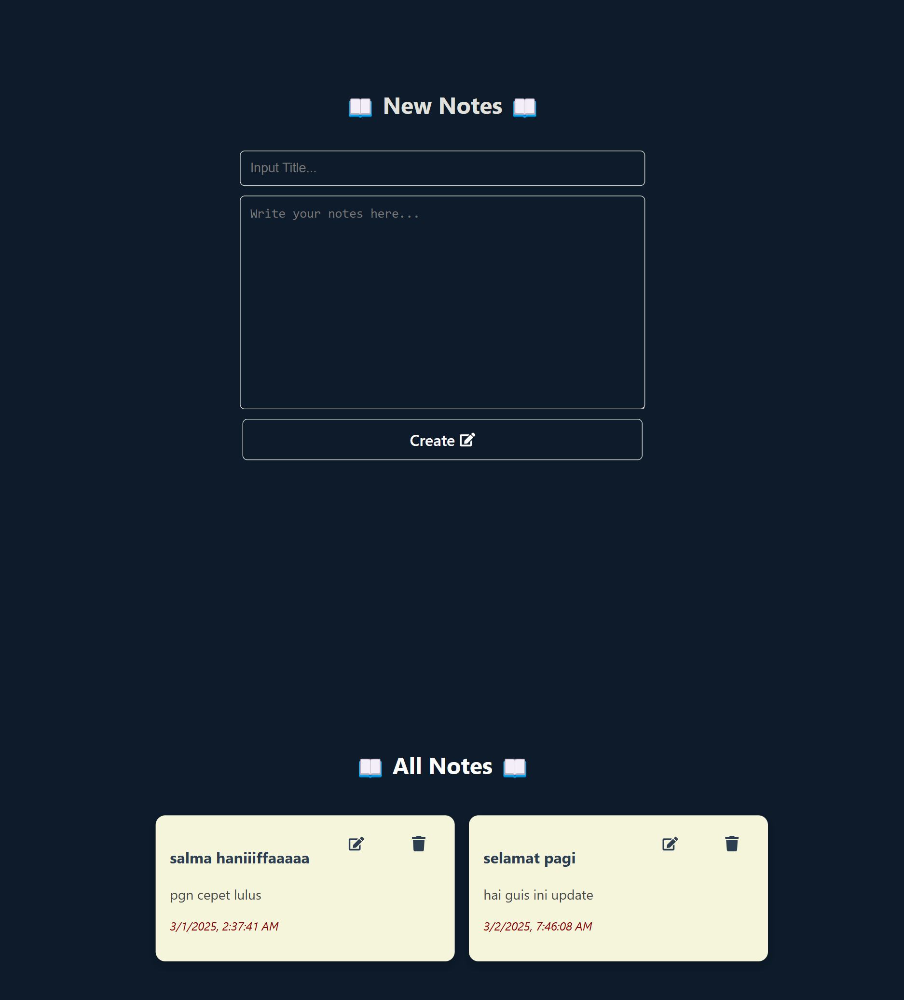

🚀 Merupakan Website Catatan Digital yang dikembangkan dengan menerapkan konsep RESTful API menggunakan Express.js sebagai backend dan React.js sebagai frontend. Aplikasi ini mampu menjalankan fungsi CRUD (Create, Read, Update, Delete) dengan baik, memungkinkan pengguna untuk menambahkan, mengedit, dan menghapus catatan secara digital.



## 📌 Instalasi & Menjalankan Proyek
Clone Repository
```sh
git clone https://github.com/salmahnf/Notes-app-tcc.git
```
### 🖥️ Setup Backend

1. Masuk ke folder `backend`di code editor.
2. **Buat & import database** di MySQL dengan nama **`notes`**.
3. **Sesuaikan parameter di backend/config**.
4. **Jalankan backend**:
   Buka terminal dan masuk ke folder `backend`:
     ```sh
     cd backend
     ```
6. Jalankan server menggunakan **nodemon**:
     ```sh
     nodemon start
     ```

---

## 🎨 Setup Frontend

1. **Buka folder `frontend` di Command Line**:
   ```sh
   cd frontend
   ```
2. Install Dependencies
      ```sh
   npm install
   ```
3. Jalankan Proyect
      ```sh
   npm run dev
   ```
